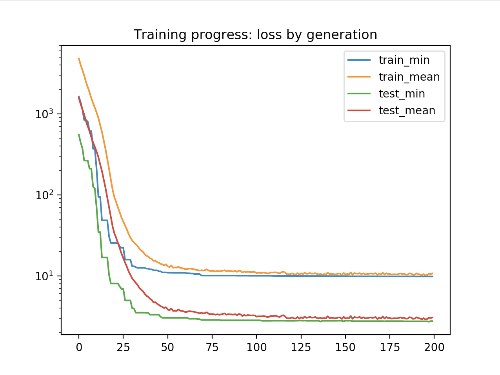

# Optimisation with Genetic Algorithms

This repository contains a genetic algorithm applied to an optimisation problem for Deakin Artificial and Computational Intelligence PBL Task 4.

We found a modestly sized dataset from [Kaggle](https://www.kaggle.com/datasets) that contains information about individuals and medical insurance costs over a year for those individuals. A genetic algorithm has been built to optimise the weights in a linear equation for predicting insurance costs, using the data in the dataset.

DATA ATTRIBUTION: Miri Choi on Kaggle at https://www.kaggle.com/mirichoi0218/insurance

## Solution Details

Genetic Algorithms are loosely inspired by evolution and the concept of natural selection. A number of domain concepts are drawn from to build the base of mathematical techniques roughly equivalent to stochastic gradient descent, without the requirement of first deriving a differentiable cost function.

### The Data

Our dataset contains 1,338 rows in a csv file with the following headings: `age,sex,bmi,children,smoker,region,charges`. Each row represents an individual with their information (columns 1-6) and an amount of medical insurance costs charged over a fixed time period (column 7). Our goal is to develop a linear equation that can predict the charges that will be incurred, from the information about a person.

We performed minimal data massaging and feature engineering, opting only to map categorical features into binary buckets and to normalise continuous features and the labels. Specifically:

* sex was mapped from a single feature of ["female", "male"] to two features, "sex0" (representing female) and "sex1" (representing male), with values of 0 or 1
* smoker was similarly mapped from a single feature of ["yes", "no"] to two binary features
* region was similarly mapped from a single feature of ["southwest", "southeast", "northwest", "northeast"] to four binary features
* age, bmi and charges were each (individually) normalised using a [scikitlearn MinMaxScaler]([sklearn.preprocessing.MinMaxScaler — scikit-learn 0.19.2 documentation](http://scikit-learn.org/stable/modules/generated/sklearn.preprocessing.MinMaxScaler.html#sklearn-preprocessing-minmaxscaler))
* children was retained as a discrete variable with range 0-5

This minimal feature engineering was performed to provide a set of features over which a linear equation could conceivably applied, and to avoid common problems when using machine learning algorithms over non-normalised data with large scale variability.

These transformations occur in the code in `driver.py` after loading the data, the original dataset is unchanged.

The data is separated into train and test sets before using the algorithm and we train only on the test set to prevent overfitting.

### Algorithm Details

Our genetic algorithm follows the standard pattern of initialising a population of chromosomes with random starting values for genes which represent a part of the problem to optimise.

In our case, since we are optimising a linear equation, each gene represents a real valued weight in a linear equation to be multiplied by a given feature value. As an example, if we had the features `blue`, `red` and `green`, then we would have 3 weights `x1`, `x2`, and `x3`. For a given row of data where `blue=1`, `red=4` and `green=3`, if we had a chromosome with `x1=0.5`, `x2=0.25` and `x3=0.33`, the linear equation would be computed as (approximately) `1 x 0.5 + 4 x 0.25 + 3 x 0.33 = 2.5`.

The size of the population is a hyperparameter. The genetic algorithm then proceeds to "evolve" for a fixed number of generations (another hyperparameter) using the following steps:

1. Parent selection and breeding
2. Offspring production with genetic crossover and gene mutation
3. Population shrinkage (death) based on fitness 

##### Parent Selection and Breeding

We implement two seperate approaches to parent selection for breeding offspring in our Genetic Algorithm. In either case, the number of parents is defined as a ratio by a hyperparameter. The first approach is simple selection of the fittest parents to breed. The second approach is stochastic selection of parents, but weighted by their fitness so that generally fitter parents are more often selected. The first approach tends to produce quicker convergence, but the additional randomness of the second approach favours long-term convergence and allows surpassing of local minima due to narrowing  of the population and insufficient diversity. Which approach is used is set by a hyperparamter.

When parents have been selected, they are arbitrarily coupled.

##### Crossover

We implement random single point genetic crossover during offspring production. Not all children necessarily involve crossover, the crossover rate is another hyperparameter. Where crossover occurs, children's genes are effectively a mix of their parents genes. One child gets the first parents genes up to a point, then the other parents after that (the other child gets the reverse).

##### Mutation

We implement per-gene random mutation of genes for each offspring, occurring at a provided mutation rate, which adjusts that genes value by a random amount within a provided mutation range. Both are algorithm hyperparameters.

##### Next Generation

Finally, the next generation is the parents, the offspring, and those other genes that survived culling due to low fitnesses.

##### Fitness

Fitness is calculated by using a chromosome to calculate predicted charges for each row of data in the training set, and computing the sum of squared differences against the actual labels for each row in the training set.

Progress is tracked during training for later analysis.

##### Hyperparameter Selection

Hyperparameters were initially estimated and adjusted through development of the algorithm. Once the algorithm was complete, we used a grid search over a portion of the potential hyperparameter state space to derive optimal values. Code for the grid search is contained in the script `run.py` and can be activated using a flag in that file. **Warning** grid search is computationally expensive, and searching over up to 7 hyperparameters creates the potential for combinatorial explosion. Representative value ranges are visible in the grid search function, but changing the flag to run this code may result in very long run time.

## Results

The results of the genetic algorithm for optimising the linear equation are mixed.

The genetic algorithm successfully converges to a solution using the provided loss minimisation function:


_Training progress by generation (loss on a logarithmic scale)_

For both the training and test sets, and for both the minimum loss (fittest chromosome) and average loss (average across population), loss starts out very high and clearly converges.

However, in actual prediction, the generated linear equation does not perform terribly well:

```
Predictions:
record 1	 prediction:   -12055	actual:     4466	difference:  -369%
record 2	 prediction:    27101	actual:    47496	difference:   -42%
record 3	 prediction:     1489	actual:    10325	difference:   -85%
record 4	 prediction:    27875	actual:    47291	difference:   -41%
record 5	 prediction:    -2905	actual:     2362	difference:  -222%
record 6	 prediction:   -18134	actual:    24671	difference:  -173%
record 7	 prediction:    13765	actual:    13352	difference:     3%
record 8	 prediction:    24571	actual:    46200	difference:   -46%
record 9	 prediction:    -3914	actual:     7144	difference:  -154%
record 10	 prediction:    29506	actual:    41919	difference:   -29%
```
_Example predictions generated across 10 random examples from the dataset, compared with actual values._

A number of possible explanations exist to explain the discrepancy between effective convergence towards the global minimum and the relatively poor predictions.

First, a linear algorithm may not be a good fit as a model for predicting insurance costs from this data. The relationship between the features in the dataset and the labels may be more complex. Second, the relatively small dataset may provide insufficient information to generate an accurate model. Third, the existing features might not be used in a sufficiently complex way to generate a good model (for example, feature crosses or higher order features are not used). Additional feature engineering might address the problem if this third issue is at play, but the purpose of this assignment was to develop an effective genetic algorithm for optimisation, not to solve the problem of predicting medical insurance costs. We believe successful convergence demonstrates this.

Examples in this section were generated using the following hyperparameters:

```
{'generations': 200, 'population_size': 200, 'breeding_rate': 0.3, 'crossover_rate': 0.9, 'mutation_rate': 0.1, 'mutation_range': 0.1, 'select_parents_stochastically': True}
```

## Usage

This application was developed using Python 3.7.0. This version is recommended.

The following external library dependencies are using in the application, including links and version numbers:

- [pandas](https://pandas.pydata.org/) (0.23.4)
- [scikit-learn](http://scikit-learn.org/) (0.19.2)
- [scipy](https://www.scipy.org/) (1.1.0)
- [numpy](http://www.numpy.org/) (1.15.t1)
- [matplotlib](https://matplotlib.org/) (2.2.3)

Each dependency can be installed using the [pip package manager](https://pypi.org/project/pip/).

To use this solution:

1. Download the code from the [GitHub repository](https://github.com/PhilipCastiglione/SIT215_PBL4)
2. Navigate inside the folder
3. Install the required dependencies (eg `brew install python3` then `pip3 install pandas`, `pip3 install scipy` etc on macOS)
4. Run the code using `python run.py` (this may be `python3 run.py` depending on your setup)

#### Notes

Random seeding of initial states can make a fairly significant difference to training results, but this differences erodes over larger generation and population sizes to become relatively negligible.

Debug options are available in the code for extended logging. They're implemented pretty naively, just uncomment the lines ending in a comment `# debug`.
